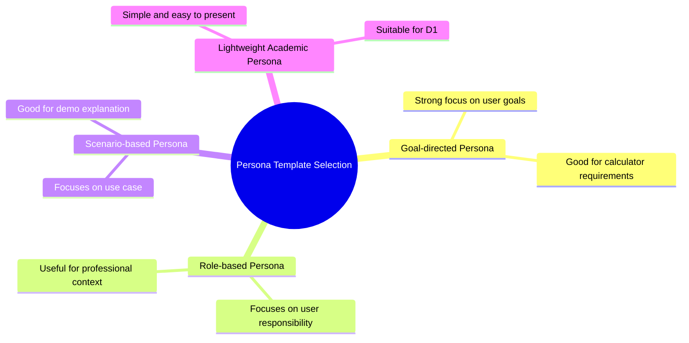
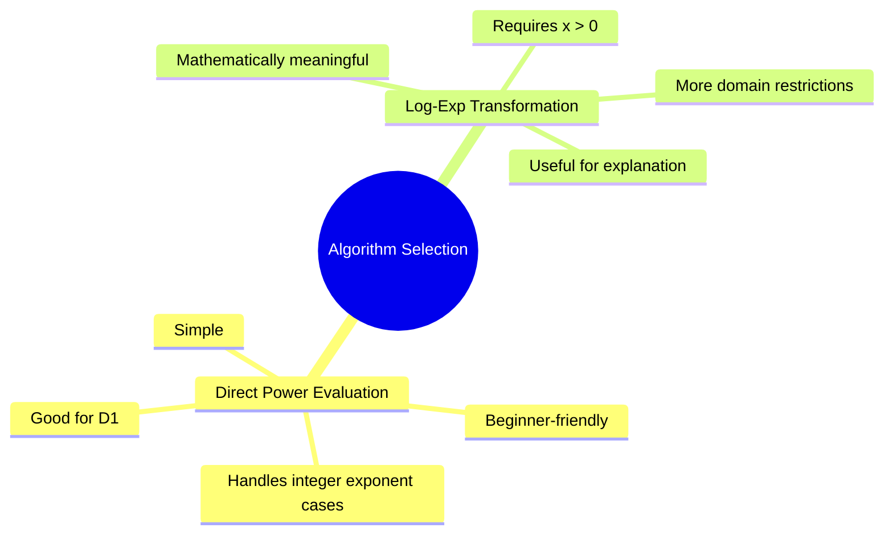
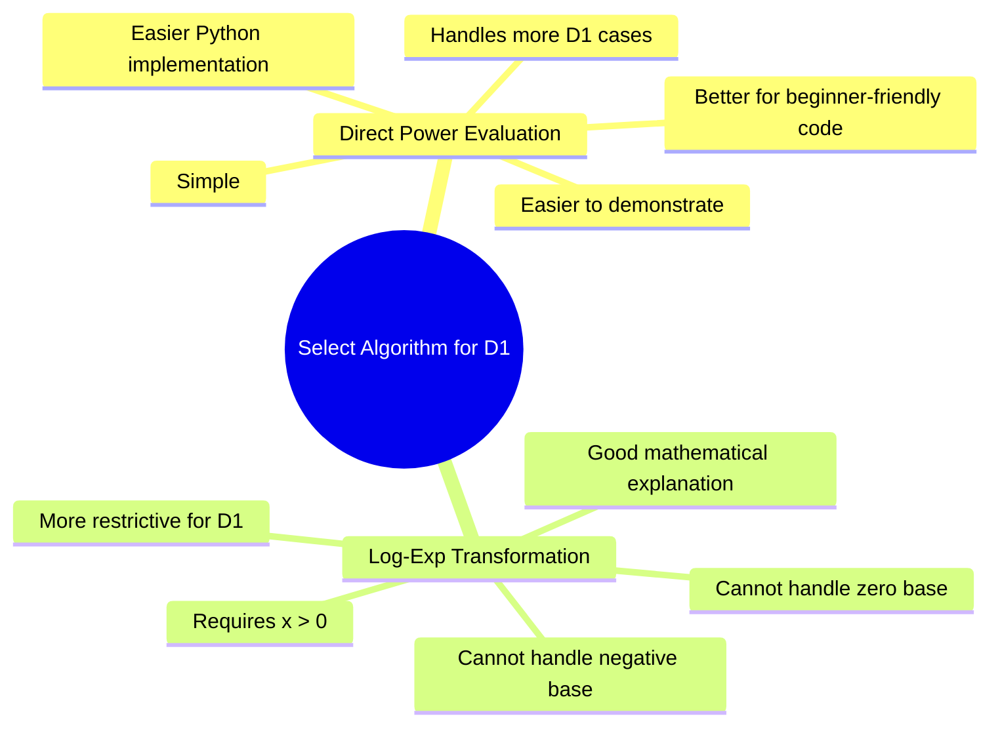

# Delivery 1: Scientific Calculator Function F7 — (x^y)

## 1. Project Overview

This Deliverable 1 focuses on the assigned scientific calculator function **F7: (x^y)**, where (x) and (y) are real variables.

This is an individual SOEN 6011 project. The purpose of D1 is to analyze the function, define a user persona, specify requirements, propose algorithms, select one algorithm, and implement a simple Python textual user interface.

The four D1 problems are connected as follows:

* Problem 1 creates the user persona.
* Problem 2 derives requirements from the persona.
* Problem 3 proposes algorithms based on the requirements.
* Problem 4 selects and implements one algorithm based on the algorithm comparison.

---

# Suggested Slide Outline

## Slide 1 — Title Slide

* SOEN 6011 Delivery 1
* Function F7: (x^y)
* Individual project
* Student name and ID

## Slide 2 — Project Overview

* Assigned function: (x^y)
* Real variables (x) and (y)
* Scientific calculator context
* D1 focuses on persona, requirements, algorithms, and implementation

## Slide 3 — GAI and CASTROFF Usage

* GAI tools used for brainstorming and first draft support
* CASTROFF elements:

  * Constraints
  * Audience
  * Structure
  * Tone
  * Role
  * Output format
  * Focus
  * Function

## Slide 4 — Problem 1 Persona Mind Map



## Slide 5 — Problem 1 Final Persona

* Selected template: Goal-directed persona
* Persona: Maya Chen
* Role: Engineering student
* Needs accurate and simple (x^y) calculation
* Wants clear error messages and understandable output

## Slide 6 — Problem 2 Assumptions

* Real-valued output only
* Complex numbers are outside D1 scope
* Main supported domain: (x > 0)
* (x = 0) handled separately
* Negative base only supported when exponent is an integer

## Slide 7 — Problem 2 Requirements

* Requirements use unique IDs
* Requirements are clear, feasible, verifiable, and traceable
* Requirements are informed by the persona

## Slide 8 — Problem 3 Algorithm 1

* Direct Power Evaluation
* Uses direct exponentiation
* Simple and easy to understand

## Slide 9 — Problem 3 Algorithm 2

* Logarithm-Exponential Transformation
* Uses (x^y = e^{y\ln(x)})
* Works mainly for (x > 0)

## Slide 10 — Problem 3 Comparison

* Simplicity
* Domain handling
* Accuracy
* Ease of implementation
* Future D2 modification

## Slide 11 — Problem 4 Algorithm Selection Mind Map



## Slide 12 — Problem 4 Python Textual UI

* User enters (x)
* User enters (y)
* Program validates input
* Program displays result or error message

## Slide 13 — Demonstration Plan

* Test valid positive base
* Test zero base
* Test negative base with integer exponent
* Test negative base with non-integer exponent
* Test invalid input

## Slide 14 — Limitations and Future Work

* Complex numbers not supported
* Precision limitations due to floating-point arithmetic
* D2 may require implementation from scratch
* GUI is not part of D1

## Slide 15 — References

* ISO/IEC/IEEE 29148 requirement guidelines
* Python documentation
* Mathematical references for exponentiation
* Persona design references
* CASTROFF framework reference

---

# Problem 1: Persona Creation

## Persona Template Comparison

| Template                     | Strength                                       | Weakness                           | Suitability |
| ---------------------------- | ---------------------------------------------- | ---------------------------------- | ----------- |
| Goal-directed persona        | Focuses on what the user wants to achieve      | May be less detailed about context | High        |
| Role-based persona           | Connects user to professional or academic role | May focus too much on job title    | Medium      |
| Scenario-based persona       | Useful for demo and use case explanation       | May be narrow                      | Medium      |
| Lightweight academic persona | Simple and easy to present                     | Less realistic detail              | High        |

## Selected Persona Template

The selected template is the **goal-directed persona**.

## Justification

The goal-directed persona is suitable because the scientific calculator function (x^y) is mainly evaluated based on what the user needs to accomplish. The user wants to enter two real numbers, receive a correct real-valued result, and understand any error messages.

## Final Persona

| Field                  | Description                                                                                                     |
| ---------------------- | --------------------------------------------------------------------------------------------------------------- |
| Name                   | Maya Chen                                                                                                       |
| Role                   | Undergraduate engineering student                                                                               |
| Background             | Maya frequently solves math, physics, and engineering problems involving exponential expressions.               |
| Technical skill level  | Intermediate computer user, beginner programmer                                                                 |
| Goals                  | Calculate (x^y) quickly and accurately for coursework problems                                                  |
| Needs                  | Simple input process, clear output, and understandable error messages                                           |
| Pain points            | Confusing calculator errors, unclear domain restrictions, and unexpected complex results                        |
| Usage scenario         | Maya enters (x) and (y) into a calculator to compute power expressions for assignments                          |
| Expectations           | The calculator should return a real-valued result or explain why the input is invalid                           |
| Requirements influence | The persona supports requirements for usability, input validation, real-valued output, and clear error handling |

---

# Problem 2: Requirements

## Assumptions

* The calculator supports real-valued output only.
* Complex number output is outside D1 scope.
* The main supported domain is (x > 0) for real-valued (y).
* If (x = 0), then (y > 0) is valid.
* If (x = 0) and (y \leq 0), the operation is invalid.
* If (x < 0), the exponent (y) must be safely treated as an integer.
* The D1 implementation uses a textual user interface.
* The implementation should be simple and suitable for later modification.

## Requirements Table

| ID     | Requirement Statement                                                     | Rationale                        | Persona Link                  | Verification               |
| ------ | ------------------------------------------------------------------------- | -------------------------------- | ----------------------------- | -------------------------- |
| FR-001 | The system shall calculate (x^y) for valid real-valued inputs.            | Core calculator function         | Maya needs power calculations | Test valid inputs          |
| IR-001 | The system shall ask the user to enter (x).                               | User must provide base           | Maya expects simple input     | Run program                |
| IR-002 | The system shall ask the user to enter (y).                               | User must provide exponent       | Maya expects simple input     | Run program                |
| IR-003 | The system shall reject non-numeric input.                                | Prevents invalid calculation     | Maya needs clear feedback     | Test text input            |
| OR-001 | The system shall display the result clearly when the input is valid.      | User needs understandable output | Maya wants clear result       | Visual inspection          |
| ER-001 | The system shall display an error when (x = 0) and (y \leq 0).            | Avoids undefined cases           | Maya needs domain explanation | Test cases                 |
| ER-002 | The system shall display an error when (x < 0) and (y) is not an integer. | Avoids complex output            | Maya expects real result only | Test negative base         |
| UR-001 | The system shall use a textual user interface.                            | Required for D1                  | Maya can use terminal input   | Run in terminal            |
| AR-001 | The system shall return results using Python floating-point arithmetic.   | Appropriate for D1 simplicity    | Maya needs practical accuracy | Compare with calculator    |
| CR-001 | The system shall not return complex-number results.                       | D1 scope is real-valued output   | Maya expects real output      | Test invalid complex cases |

## How Problem 1 Informed Problem 2

The persona shows that the target user needs a simple and reliable calculator function. Therefore, the requirements emphasize clear input prompts, real-valued output, invalid input handling, and understandable error messages.

---

# Problem 3: Algorithms

## Algorithm 1: Direct Power Evaluation

### Purpose

Calculate (x^y) directly after validating the real-valued domain.

### Input

* Real number (x)
* Real number (y)

### Output

* Real-valued result of (x^y), or an error message

### Preconditions

* (x) and (y) must be numeric.
* The result must be real-valued.

### Postconditions

* If valid, the system returns (x^y).
* If invalid, the system returns a clear error.

### Pseudocode

```text
ALGORITHM DirectPowerEvaluation
INPUT: x, y
OUTPUT: result or error message

IF x is not numeric OR y is not numeric THEN
    RETURN "Invalid input"

IF x = 0 AND y <= 0 THEN
    RETURN "Error: zero base with non-positive exponent is invalid"

IF x < 0 AND y is not an integer THEN
    RETURN "Error: negative base with non-integer exponent is outside real-valued scope"

result ← x raised to the power y

RETURN result
END ALGORITHM
```

### Advantages

* Simple
* Easy to explain
* Suitable for D1
* Easy to connect to Python implementation

### Disadvantages

* Depends on built-in arithmetic behavior
* Floating-point limitations may occur
* Some advanced domain cases are simplified

### Requirements Supported

FR-001, IR-001, IR-002, ER-001, ER-002, OR-001, UR-001, AR-001, CR-001

---

## Algorithm 2: Logarithm-Exponential Transformation

### Purpose

Calculate (x^y) using the identity:

[
x^y = e^{y\ln(x)}
]

### Input

* Real number (x)
* Real number (y)

### Output

* Real-valued result of (x^y), or an error message

### Preconditions

* (x > 0)
* (x) and (y) must be numeric

### Postconditions

* If valid, the system returns (e^{y\ln(x)}).
* If invalid, the system returns an error.

### Pseudocode

```text
ALGORITHM LogExpPowerEvaluation
INPUT: x, y
OUTPUT: result or error message

IF x is not numeric OR y is not numeric THEN
    RETURN "Invalid input"

IF x <= 0 THEN
    RETURN "Error: logarithm-exponential method requires x > 0"

logValue ← natural logarithm of x
exponentValue ← y multiplied by logValue
result ← exponential of exponentValue

RETURN result
END ALGORITHM
```

### Advantages

* Mathematically meaningful
* Useful for explaining exponentiation
* Works well when (x > 0)

### Disadvantages

* Does not directly support (x = 0)
* Does not support negative bases
* More restrictive than Algorithm 1
* May introduce additional floating-point approximation

### Requirements Supported

FR-001, IR-001, IR-002, OR-001, UR-001, AR-001

---

# Problem 4: Algorithm Selection

## Algorithm Selection Mind Map



## Selected Algorithm

The selected algorithm is **Algorithm 1: Direct Power Evaluation**.

## Justification

Algorithm 1 is selected because it is simpler, easier to demonstrate, and better aligned with the D1 requirement for a Python textual user interface. It also allows explicit handling of zero and negative base cases.

## Rejected Algorithm

Algorithm 2 is not selected because it requires (x > 0). This makes it less flexible for a calculator function that should also explain cases such as (x = 0) or negative bases.

## Risks and Limitations

* Floating-point arithmetic may create rounding errors.
* Negative bases with non-integer exponents are excluded from D1.
* Complex-number results are not supported.
* Future D2 work may require implementing the function from scratch without direct built-in exponentiation.

---

# Python Textual UI Implementation

```python
def is_integer_value(value):
    return float(value).is_integer()


def calculate_power(x, y):
    if x == 0 and y <= 0:
        return None, "Error: 0 raised to a non-positive exponent is undefined."

    if x < 0 and not is_integer_value(y):
        return None, "Error: negative base with non-integer exponent is outside the real-valued scope."

    result = x ** y
    return result, None


def main():
    print("Scientific Calculator Function F7: x^y")

    try:
        x = float(input("Enter the value of x: "))
        y = float(input("Enter the value of y: "))
    except ValueError:
        print("Error: Please enter valid numeric values.")
        return

    result, error = calculate_power(x, y)

    if error:
        print(error)
    else:
        print(f"Result: {x}^{y} = {result}")


if __name__ == "__main__":
    main()
```

## Example Inputs and Outputs

### Example 1

```text
Enter the value of x: 2
Enter the value of y: 3
Result: 2.0^3.0 = 8.0
```

### Example 2

```text
Enter the value of x: 0
Enter the value of y: -1
Error: 0 raised to a non-positive exponent is undefined.
```

### Example 3

```text
Enter the value of x: -2
Enter the value of y: 0.5
Error: negative base with non-integer exponent is outside the real-valued scope.
```

### Example 4

```text
Enter the value of x: abc
Error: Please enter valid numeric values.
```

## Requirement Satisfaction

| Requirement | Satisfied By                                   |
| ----------- | ---------------------------------------------- |
| FR-001      | `calculate_power(x, y)` computes (x^y)         |
| IR-001      | Program asks for (x)                           |
| IR-002      | Program asks for (y)                           |
| IR-003      | `try-except` catches invalid input             |
| OR-001      | Program prints the result clearly              |
| ER-001      | Checks (x = 0) and (y \leq 0)                  |
| ER-002      | Checks negative base with non-integer exponent |
| UR-001      | Uses terminal text input/output                |
| AR-001      | Uses Python floating-point arithmetic          |
| CR-001      | Rejects complex-number cases                   |

---

# GAI Use Explanation

This prompt was intended to obtain a structured first draft for SOEN 6011 Delivery 1. It helped generate ideas for persona creation, requirements, algorithm comparison, and Python implementation.

The GAI output should not be treated as final truth. The student must review, test, rewrite, and verify the content before submission.

## Manual Review Needed

* Verify mathematical domain restrictions for (x^y).
* Confirm that requirements are clear, atomic, feasible, and testable.
* Test the Python implementation manually.
* Rewrite generated text in the student’s own words.
* Add citations for standards, mathematical definitions, persona design, Python documentation, and CASTROFF.

---

# Prompt Types Used

| Problem           | Prompt Type                                       | Purpose                        | Expected Output                    | Manual Review Needed          |
| ----------------- | ------------------------------------------------- | ------------------------------ | ---------------------------------- | ----------------------------- |
| Problem 1         | Ideation and decision-support prompt              | Select persona template        | Persona mind map and final persona | Check realism and relevance   |
| Problem 2         | Requirements elicitation and specification prompt | Generate requirements          | Requirements table                 | Check clarity and testability |
| Problem 3         | Algorithm generation and comparison prompt        | Generate two algorithms        | Pseudocode and comparison          | Check correctness             |
| Problem 4         | Decision-making and code generation prompt        | Select and implement algorithm | Mind map and Python code           | Test implementation           |
| Final integration | Organization and presentation prompt              | Prepare D1 structure           | Slide outline and report draft     | Rewrite and cite              |

---

# Potential References To Verify

* ISO/IEC/IEEE 29148 requirements engineering standard
* Python official documentation for arithmetic operations and floating-point behavior
* Mathematical references for exponentiation and logarithm-exponential transformation
* Persona design or user-centered design references
* CASTROFF framework reference

---

# Validation Checklist

| Item                                     | Status |
| ---------------------------------------- | ------ |
| D1 only                                  | Yes    |
| Individual work stated                   | Yes    |
| Function F7 (x^y) stated                 | Yes    |
| Persona included                         | Yes    |
| Persona template selected using mind map | Yes    |
| Requirements use unique IDs              | Yes    |
| Assumptions explicit                     | Yes    |
| Problem 2 informed by Problem 1          | Yes    |
| Two algorithms included                  | Yes    |
| Problem 3 informed by Problem 2          | Yes    |
| Algorithm selected using mind map        | Yes    |
| Python textual UI included               | Yes    |
| Problem 4 informed by Problem 3          | Yes    |
| GAI use documented                       | Yes    |
| Prompt types documented                  | Yes    |
| Output explanations included             | Yes    |
| Citations and references planned         | Yes    |
| LaTeX-ready structure                    | Yes    |
