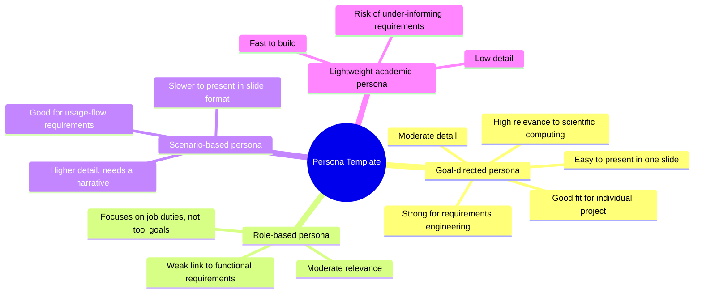
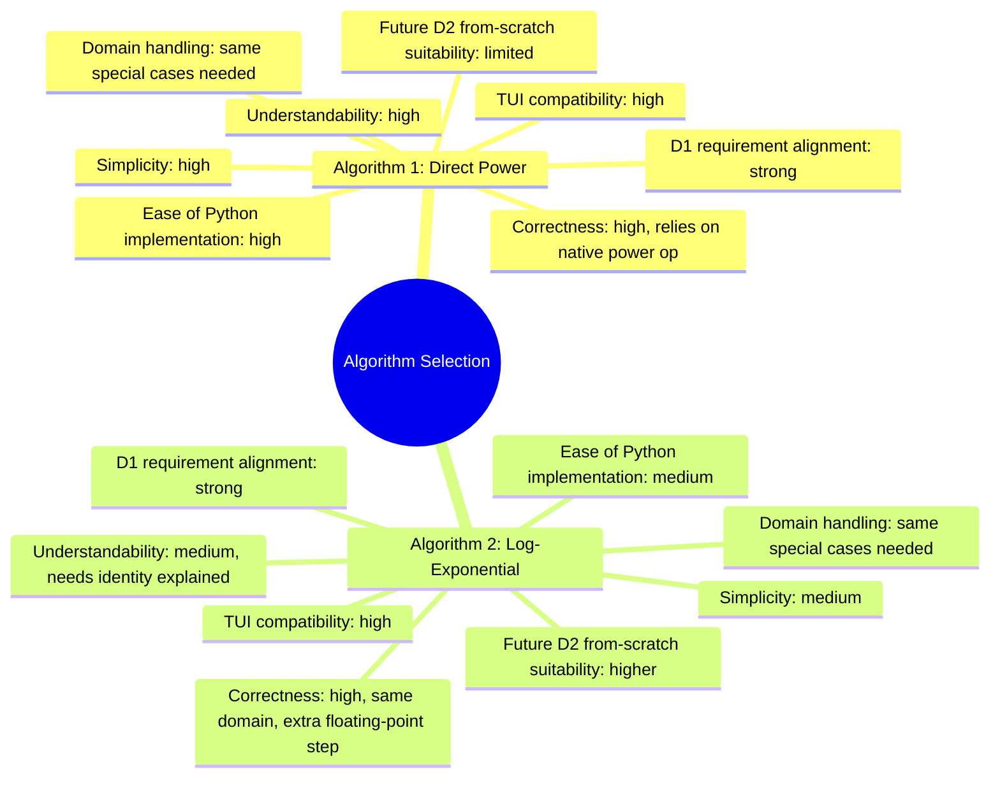

# SOEN 6011 — Deliverable 1 Draft (F7: x^y)

> **Status:** GAI-assisted first draft only. This is brainstorming and organizational
> support, not final submission content. See "GAI Use Explanation" and the
> "Validation Checklist" before using any part of this in slides or a LaTeX report.

---

## 1. Project Overview

| Item | Description |
|---|---|
| Assigned function | F7: \(x^y\), where \(x\) and \(y\) are real variables |
| Project scope | Individual work — SOEN 6011 Deliverable 1 only |
| Main D1 artifacts | (1) Persona, (2) ISO/IEC/IEEE 29148-style requirements, (3) two language-independent algorithms, (4) Python textual UI implementation |
| Dependency chain | Persona (P1) → Requirements (P2) → Algorithms (P3) → Selected algorithm + implementation (P4). Each problem is explicitly informed by the one before it. |
| Out of scope | D2 from-scratch reimplementation, GUI requirements, complex-number output |


---

## 2. Slide-by-Slide Outline (D1)

| # | Slide | Suggested bullets |
|---|---|---|
| 1 | Title slide | Course, deliverable, function F7 (x^y), student name, date |
| 2 | Project overview | Individual scope, D1 focus, 4-problem dependency chain |
| 3 | GAI and CASTROFF usage | Which GAI tool(s) used, CASTROFF framework summary, why used |
| 4 | Problem 1 — persona mind map | Template options compared, chosen criteria |
| 5 | Problem 1 — final persona | Name, role, goals, needs, pain points |
| 6 | Problem 2 — assumptions | Explicit assumptions list, domain restrictions |
| 7 | Problem 2 — requirements | Requirements table with unique IDs |
| 8 | Problem 3 — algorithm 1 | Direct power evaluation, pseudocode summary |
| 9 | Problem 3 — algorithm 2 | Log-exponential transformation, pseudocode summary |
| 10 | Problem 3 — comparison | Advantages/disadvantages side by side |
| 11 | Problem 4 — selection mind map | Comparison criteria, chosen algorithm |
| 12 | Problem 4 — Python TUI | Code walkthrough, sample run |
| 13 | Demonstration plan | Live input/output cases to show on Zoom |
| 14 | Limitations and future work | Domain gaps, D2 outlook |
| 15 | References | Standards, docs, math references (see §10) |

---

## 3. Problem 1 — Persona

### 3.1 Persona template comparison (mind map)



**Comparison table**

| Criterion | Goal-directed | Role-based | Scenario-based | Lightweight academic |
|---|---|---|---|---|
| Relevance to scientific computing software | High | Medium | Medium | Low |
| Usefulness for requirements engineering | High | Medium | High | Low |
| Level of detail | Medium | Medium | High | Low |
| Suitability for individual student project | High | Medium | Medium | High |
| Ease of presentation | High | High | Medium | High |

**Selected template:** Goal-directed persona.

**Justification:** A goal-directed persona centers on what the user is trying to
accomplish with the \(x^y\) function (correct, fast, understandable results),
which maps directly onto testable functional requirements. It is detailed
enough to justify requirements in Problem 2 while remaining compact enough
for a single slide and an individual project timeline.

### 3.2 Final persona

| Field | Value |
|---|---|
| Name | Priya Anand |
| Role | Second-year engineering student, part-time lab assistant |
| Background | Comfortable with basic math and simple software tools; not a programmer |
| Technical skill level | Novice-to-intermediate; can use a command-line tool if instructions are clear |
| Goals | Quickly compute \(x^y\) for lab reports and homework checks without a full calculator app |
| Needs | Clear numeric input prompts; unambiguous result display; understandable error messages |
| Pain points | Confusing error messages from existing tools; unclear behavior for edge cases like \(0^0\) or negative bases |
| Usage scenario | Priya runs the program from a terminal, enters a base and exponent from her lab data, and reads the result to paste into her report |
| Expectations from the calculator | Correct real-valued result when possible; a clear statement (not a crash) when the input is outside the supported domain |
| How the persona informs requirements | Drives requirements for input validation, plain-language error messages, and restricting output to real numbers (Problem 2) |

---

## 4. Problem 2 — Requirements (informed by Problem 1)

### 4.1 Assumptions

- The calculator produces real-valued output only; complex results are out of scope for D1.
- For \(x > 0\), any real \(y\) is supported.
- For \(x = 0\): result is \(0\) if \(y > 0\); undefined (error) if \(y \le 0\).
- For \(x < 0\): only supported if \(y\) is (or can safely be treated as) an integer, since otherwise the mathematically correct result is complex.
- Standard Python arithmetic and math library functions may be used in D1.
- The interface is textual (console), not graphical.
- The implementation should stay simple enough to be revised in D2.

### 4.2 Requirements table (ISO/IEC/IEEE 29148 style — single-statement functional/non-functional requirement format, "the system shall...")

| ID | Requirement statement | Rationale | Persona link | Verification method |
|---|---|---|---|---|
| FR-001 | The system shall compute \(x^y\) for real \(x\) and \(y\) within the supported domain. | Core function of the calculator | Priya needs a correct result for lab reports | Test with representative \((x,y)\) pairs |
| IR-001 | The system shall prompt the user to enter \(x\) and \(y\) as separate inputs. | Matches the persona's simple, guided usage pattern | Priya expects clear prompts | Manual walkthrough of prompts |
| IR-002 | The system shall reject non-numeric input for \(x\) or \(y\) and re-prompt or report an error. | Prevents crashes on bad input | Priya is a novice user | Enter letters/symbols, confirm graceful handling |
| OR-001 | The system shall display the computed result clearly labeled as the result of \(x^y\). | Avoids ambiguity in output | Priya needs to paste unambiguous results | Visual inspection of output text |
| CR-001 | The system shall restrict output to real numbers and shall not return complex results. | Matches D1 scope assumption | Matches persona expectation of a "normal" result | Test cases that would be complex in full math (e.g., negative base, fractional exponent) |
| ER-001 | The system shall report a clear error message when \(x = 0\) and \(y \le 0\). | Undefined mathematical case | Priya's pain point: confusing error messages | Test with \(x=0, y=0\) and \(x=0, y=-1\) |
| ER-002 | The system shall report a clear error message when \(x < 0\) and \(y\) is not an integer. | Avoids silently returning a complex/incorrect value | Priya's pain point: confusing error messages | Test with \(x=-2, y=0.5\) |
| UR-001 | The system shall use plain-language prompts and error messages understandable to a non-programmer. | Matches persona's novice skill level | Priya is not a programmer | Peer review of message wording |
| AR-001 | The system shall compute results using standard double-precision arithmetic without introducing avoidable rounding errors beyond what the underlying language provides. | Baseline accuracy expectation | Priya needs trustworthy numbers for a report | Compare output against known reference values |

### 4.3 How Problem 1 informed Problem 2

The persona's novice skill level directly motivated the usability requirements
(UR-001) and the input-validation requirements (IR-002, ER-001, ER-002): because
Priya is not a programmer and has been frustrated by unclear tools before, the
requirements emphasize plain-language prompts and explicit error handling rather
than assuming an expert user who would tolerate cryptic failures.

---

## 5. Problem 3 — Algorithms (informed by Problem 2)

### 5.1 Algorithm 1: Direct Power Evaluation

- **Purpose:** Compute \(x^y\) directly using repeated multiplication or a built-in power operation, restricted to the supported real domain.
- **Input:** Real numbers \(x\), \(y\).
- **Output:** Real number result, or an error indicator.
- **Preconditions:** \(x\) and \(y\) are valid real numbers; if \(x < 0\), \(y\) must be an integer; if \(x = 0\), \(y > 0\).
- **Postconditions:** Output equals \(x^y\) within floating-point precision, or an explicit error is returned.

```text
ALGORITHM DirectPower(x, y)
  IF x = 0 THEN
    IF y > 0 THEN
      RETURN 0
    ELSE
      RETURN ERROR "undefined: 0 raised to non-positive exponent"
    END IF
  END IF

  IF x < 0 AND NOT IsInteger(y) THEN
    RETURN ERROR "undefined for real output: negative base with non-integer exponent"
  END IF

  result <- Power(x, y)   // language's native power operation
  RETURN result
END ALGORITHM
```

- **Domain limitations:** Cannot return a real value for negative \(x\) with a non-integer \(y\); relies on the correctness of the underlying native power operation.
- **Advantages:** Simple, easy to read, minimal code, directly maps to FR-001 and OR-001.
- **Disadvantages:** Offers little insight into *why* the result is computed the way it is; less flexible if later deliverables require a from-scratch numeric method.
- **Requirements supported:** FR-001, IR-001, OR-001, CR-001, ER-001, ER-002, AR-001.

### 5.2 Algorithm 2: Logarithm-Exponential Transformation

- **Purpose:** Compute \(x^y\) using the identity \(x^y = e^{y \ln(x)}\), valid for \(x > 0\).
- **Input:** Real numbers \(x\), \(y\).
- **Output:** Real number result, or an error indicator.
- **Preconditions:** \(x > 0\) for the log-exponential path; \(x = 0\) and \(x < 0\) handled as special cases outside the identity.
- **Postconditions:** Output equals \(x^y\) within floating-point precision, or an explicit error is returned.

```text
ALGORITHM LogExpPower(x, y)
  IF x = 0 THEN
    IF y > 0 THEN
      RETURN 0
    ELSE
      RETURN ERROR "undefined: 0 raised to non-positive exponent"
    END IF
  END IF

  IF x < 0 THEN
    IF IsInteger(y) THEN
      // fall back to direct evaluation for negative integer-exponent case
      RETURN DirectPower(x, y)
    ELSE
      RETURN ERROR "undefined for real output: negative base with non-integer exponent"
    END IF
  END IF

  // x > 0 here
  logX <- NaturalLog(x)
  exponent <- y * logX
  result <- Exp(exponent)
  RETURN result
END ALGORITHM
```

- **Domain limitations:** The log-exponential identity itself only applies for \(x > 0\); negative and zero bases still need the same special-case handling as Algorithm 1.
- **Advantages:** Reflects the underlying mathematical identity explicitly, which can be pedagogically clearer and may generalize more naturally if D2 asks for a from-scratch numeric implementation of `ln` and `exp`.
- **Disadvantages:** Slightly more computation (two function calls instead of one) and slightly more exposure to floating-point error accumulation than a single native power call.
- **Requirements supported:** FR-001, IR-001, OR-001, CR-001, ER-001, ER-002, AR-001.

---

## 6. Problem 4 — Algorithm Selection (informed by Problem 3)

### 6.1 Selection mind map



**Comparison table**

| Criterion | Algorithm 1 (Direct) | Algorithm 2 (Log-Exp) |
|---|---|---|
| Simplicity | High | Medium |
| Correctness for real-valued outputs | High | High |
| Ease of implementation in Python | High | Medium |
| Compatibility with textual UI | High | High |
| Understandability for users | High | Medium |
| Domain handling | Same special-case logic needed | Same special-case logic needed |
| Alignment with D1 requirements | Strong | Strong |
| Suitability for future D2 from-scratch work | Limited (depends on native `**`) | Higher (mirrors `ln`/`exp` building blocks) |

### 6.2 Selected algorithm

**Selected:** Algorithm 1 — Direct Power Evaluation.

**Justification:** For D1, simplicity, readability, and direct traceability to
the requirements in Problem 2 (especially UR-001, plain-language usability for
a novice persona) outweigh the pedagogical benefit of the log-exponential
identity. Both algorithms need identical special-case handling for \(x=0\) and
negative bases, so Algorithm 2's extra complexity does not buy additional
domain coverage in D1.

**Rejected:** Algorithm 2 — Logarithm-Exponential Transformation. Reason: it
adds an extra computation step and an extra explanation burden for the same
domain coverage, without a D1-level requirement that specifically calls for
demonstrating the log-exponential identity.

**Risks/limitations of the selected algorithm:** It depends on the correctness
and precision of the language's native power operation; if D2 requires a
from-scratch numeric implementation of exponentiation, this algorithm alone
will not satisfy that requirement and Algorithm 2's approach may need to be
revisited then.

**Link back:** This selection directly implements the pseudocode from Problem 3
(§5.1) and satisfies the requirements table from Problem 2 (§4.2), particularly
FR-001, CR-001, ER-001, ER-002, and UR-001.

---

## 7. Python Textual User Interface Implementation

```python
"""
SOEN 6011 - Deliverable 1
Function F7: x^y (real-valued output only)
Algorithm: Direct Power Evaluation (Problem 3, Algorithm 1)
Textual (console) user interface.
"""

def is_integer(value: float) -> bool:
    """Return True if a float value represents a whole number."""
    return value == int(value)


def compute_power(x: float, y: float):
    """
    Compute x ** y restricted to real-valued output.
    Returns (result, error_message). Exactly one of the two is None.
    """
    if x == 0:
        if y > 0:
            return 0.0, None
        else:
            return None, "Undefined: 0 raised to a non-positive exponent."

    if x < 0 and not is_integer(y):
        return None, "Undefined for real output: negative base with a non-integer exponent."

    try:
        result = x ** y
    except OverflowError:
        return None, "Result is too large to represent."
    return result, None


def read_float(prompt: str):
    """Prompt the user for a float, re-prompting on invalid input."""
    while True:
        raw = input(prompt).strip()
        try:
            return float(raw)
        except ValueError:
            print("Invalid input. Please enter a numeric value (e.g., 2, -3.5, 0.25).")


def main():
    print("=== x^y Calculator (SOEN 6011 - Deliverable 1) ===")
    x = read_float("Enter the base x: ")
    y = read_float("Enter the exponent y: ")

    result, error = compute_power(x, y)

    if error is not None:
        print(f"Error: {error}")
    else:
        print(f"Result: {x} ^ {y} = {result}")


if __name__ == "__main__":
    main()
```

**Example run 1 (typical case)**
```
Enter the base x: 2
Enter the exponent y: 10
Result: 2.0 ^ 10.0 = 1024.0
```

**Example run 2 (domain error)**
```
Enter the base x: -2
Enter the exponent y: 0.5
Error: Undefined for real output: negative base with a non-integer exponent.
```

**Example run 3 (invalid input handling)**
```
Enter the base x: abc
Invalid input. Please enter a numeric value (e.g., 2, -3.5, 0.25).
Enter the base x: 3
Enter the exponent y: 2
Result: 3.0 ^ 2.0 = 9.0
```

**How the implementation satisfies Problem 2 requirements**

| Requirement | Where satisfied in code |
|---|---|
| FR-001 | `compute_power` computes \(x^y\) |
| IR-001 | Two separate `read_float` prompts for `x` and `y` |
| IR-002 | `read_float` loops until valid numeric input |
| OR-001 | Final `print` clearly labels the result |
| CR-001 | Domain checks prevent returning a complex-valued case |
| ER-001 | `x == 0` branch with `y <= 0` returns an explicit error |
| ER-002 | `x < 0` and non-integer `y` branch returns an explicit error |
| UR-001 | Plain-language prompts and error strings |
| AR-001 | Uses Python's native double-precision `**` operator |

**Known limitations**

- Relies on Python's native `**` operator rather than a from-scratch numeric method (acceptable for D1 per the assumptions; may need revisiting in D2).
- Very large results may raise `OverflowError`, which is caught but not further categorized.
- Floating-point precision limits apply, as with any double-precision arithmetic.
- Does not attempt to support complex-number output; this is intentionally out of D1 scope.

---

## 8. GAI Use Explanation

- **What this prompt was intended to obtain:** organizational scaffolding and a
  first draft for all four D1 problems (persona, requirements, algorithms,
  selection + implementation) using the CASTROFF framework to keep the GAI's
  output aligned with course constraints.
- **Prompt type used per problem:** see the "Prompt Types Used" table below.
- **How the output should be reviewed and modified before submission:** every
  claim (mathematical, standards-related, or design-related) must be checked
  by the student; wording must be rewritten in the student's own voice;
  requirement IDs and traceability links must be manually verified; the Python
  code must be run and tested, not just read.
- **Which parts require external citation or verification:** the ISO/IEC/IEEE
  29148 requirement style, the CASTROFF framework reference, any persona
  design references, and the mathematical identity \(x^y = e^{y \ln x}\).
- **How the student manually checks correctness:** by running the Python
  program with representative and edge-case inputs (typical values, \(x=0\),
  negative \(x\) with integer and non-integer \(y\), invalid text input) and
  comparing results to known values.
- **Why the GAI output should not be treated as final truth:** GAI-generated
  content can misstate standards details, omit edge cases, or use
  plausible-sounding but incorrect mathematical framing; it must be treated as
  a draft to be verified, not an authoritative source.

---

## 9. Prompt Types Used

| Problem | Prompt type | Purpose | Expected output | Manual review needed |
|---|---|---|---|---|
| 1 | Ideation and decision-support prompt | Generate and compare persona template options | Mind map + selected persona | Verify persona realism and relevance |
| 2 | Requirements elicitation and specification prompt | Draft ISO/IEC/IEEE 29148-style requirements | Requirements table with IDs | Verify wording, IDs, and standard alignment |
| 3 | Algorithm generation and comparison prompt | Produce two independent pseudocode algorithms | Pseudocode + pros/cons | Verify mathematical correctness and domain handling |
| 4 | Decision-making and code generation prompt | Select an algorithm and implement it | Mind map + Python code | Test code; verify justification logic |
| Final integration | Organization and presentation prompt | Assemble everything into a presentation-ready structure | Slide outline + consolidated draft | Confirm consistency and traceability across problems |

---

## 10. Potential References To Verify

- ISO/IEC/IEEE 29148 requirements engineering standard (verify exact edition/year and specific clause used for the requirement style chosen).
- Official Python documentation for numeric types and the `**` operator / `math` module.
- Mathematical references for exponentiation and the logarithm-exponential identity \(x^y = e^{y\ln x}\) (a calculus or precalculus textbook, or a reputable math reference).
- Persona design / user-centered design references (e.g., foundational UX or requirements-engineering literature on personas).
- CASTROFF framework reference: Tavakoli, H. (2026). *The CASTROFF Framework: A Professional Standard for Prompt Engineering.* In *Prompt Engineering for Everyone.* Apress. https://doi.org/10.1007/979-8-8688-2338-1_6

> Note: exact bibliographic details beyond the CASTROFF reference above (which was supplied by the student) have not been invented and must be located and verified by the student before citation.

---

## 11. Validation Checklist

- [ ] D1 only — no D2/D3 content included
- [ ] Individual work explicitly stated
- [ ] Function F7, \(x^y\), stated
- [ ] Persona included
- [ ] Persona template selected using a mind map
- [ ] Requirements use unique IDs
- [ ] Assumptions made explicit
- [ ] Problem 2 informed by Problem 1
- [ ] Two algorithms included
- [ ] Problem 3 informed by Problem 2
- [ ] Algorithm selected using a mind map
- [ ] Python textual UI included
- [ ] Problem 4 informed by Problem 3
- [ ] GAI use documented
- [ ] Prompt types documented
- [ ] Output explanations included
- [ ] Citations and references planned
- [ ] LaTeX-ready structure
